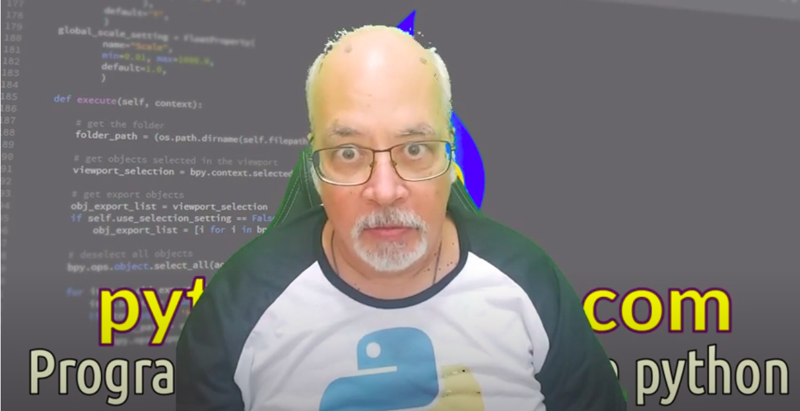

# pythondrops
## Python drops &amp; technology

(c) 2021 [**Cleuton Sampaio**](https://github.com/cleuton).

### Exemplo RESTful Python
[**Veja este exemplo**](./restful_python/) de aplicação REST WSGI com boas práticas para você usar em qualquer projeto. 

### Programação Backend com Python

Curso de programação backend com python. Nesse curso, você aprenderá a linguagem python e os recursos para criar backends usando: REST, HTTPS, AMQP, gRPC e AWS (Lambda). Esse curso será lançado na **Udemy** em breve, mas também teremos turmas online ao vivo. 
Clique na imagem para ver a página do **curso**.

- [O **Curso Básico de Python** Está de volta!](./curso)
- [**Modulos e Imports**](./modulos_imports);
- [**Virtual environment**](./virtual_environment);
- [**Packages**](./packages);
- [**Clientes e Servidores HTTP**](./clientes_servidores)
- [**Servindo MongoDB**](./servindo_mongodb)
- [**Bigdata com Python & Spark**](./bigdata)
- [**Tutorial de controle de acesso com JWT**](https://github.com/cleuton/jwt/blob/master/README.md)
