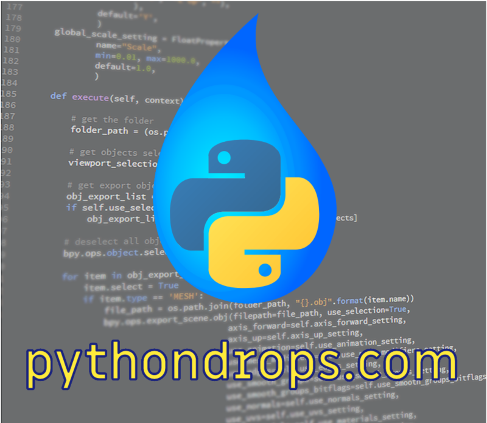

# pythondrops
## Python drops &amp; technology

(c) 2018 [**Cleuton Sampaio**](https://github.com/cleuton).

- O **Curso Básico de Python** está sendo atualizado e em breve lançaremos mais cursos em múltiplas plataformas. 
    - Estamos reformulando o curso e criando mais cursos especializados para você, que estarão disponíveis pela [**Udemy**](http://udemy.com). Em breve!
- [**Modulos e Imports**](./modulos_imports);
- [**Virtual environment**](./virtual_environment);
- [**Packages**](./packages);
- [**Clientes e Servidores HTTP**](./clientes_servidores)
- [**Servindo MongoDB**](./servindo_mongodb)
- [**Bigdata com Python & Spark**](./bigdata)
