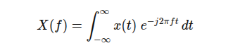
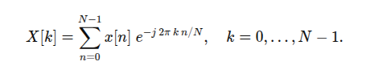

# Reconhecimento de comando de voz sem modelos de IA

[**Cleuton Sampaio**](https://linkedin.com/in/cleutonsampaio).

Veja no [**repositório**](https://github.com/cleuton/pythondrops/tree/master/audio_fft). 

Entender o problema e o algoritmo (G-21 do Clean Code) é essencial para criar uma solução eficaz. Muita gente corre atrás de IA, seja para 
usar modelos pré-treinados ou para criar o código-fonte, sem entender o que é necessário. Você precisa analisar o problema e
buscar técnicas, ferramentas e algoritmos adequados. 

Imagine o seguinte problema: 

> Temos um **SoC** de computação de **borda** que precisa reconhecer comandos de voz e tomar ações. Esses comandos são palavras curtas em uma frase. Se presentes, ele precisa acionar algum dispositivo. 

Problema simples, não? Poderíamos usar um modelo de **IA** de reconhecimento de fala e tudo estaria resolvido. Só que tem um detalhe: 

> O sistema deve funcionar **offline**. 

E agora? 

Aí entram algumas técnicas interessantes, como: 

1. **Correlação cruzada no domínio do tempo**  
   Calcula diretamente a similaridade entre o trecho referência e todos os deslocamentos do sinal de entrada, somando produto ponto a ponto. É simples, mas custa O(N·M) de tempo (onde N e M são comprimentos dos sinais).

2. **Correlação cruzada via FFT**  
   Usa FFT/IFFT para converter os sinais ao domínio da frequência, multiplicar espectros (com conjugado) e retornar ao tempo, reduzindo o custo para O((N+M)·log(N+M)).  

3. **Template matching com DTW (Dynamic Time Warping)**  
   Extrai características (por exemplo, MFCC) de ambos os sinais e aplica DTW para alinhar sequências de comprimentos diferentes, tolerando variações de tempo na pronúncia.  

4. **Modelos ocultos de Markov (HMM)**  
   Treina um HMM para o padrão da palavra com features acústicas (tipicamente MFCC), depois usa o algoritmo de Viterbi para verificar a probabilidade de ocorrência no áudio de entrada.  

5. **MFCC + GMM (Gaussian Mixture Models)**  
   Representa as distribuições de coeficientes cepstrais por misturas gaussianas e avalia a probabilidade de cada frame pertencer ao modelo da palavra, detectando janelas de alta probabilidade.  

6. **Redes neurais (CNN/RNN/LSTM)**  
   Alimenta espectrogramas ou sequências de MFCCs em redes profundas treinadas para keyword spotting, obtendo classificadores capazes de lidar com ruído e variações de voz.  

7. **Transformada wavelet**  
   Decompõe o sinal em diversas escalas temporo-frequenciais, permitindo detectar padrões locais de forma mais robusta a ruídos de características não estacionárias.  

Em nosso caso, vamos combinar filtragem passa-banda (para isolar a faixa de voz e reduzir ruído), correlação cruzada via FFT (pelo ganho de eficiência computacional) e normalização local por energia (Coeficiente de Correlação Normalizada) seguida de limiarização. Essa abordagem é simples de implementar, roda rápido mesmo em áudios longos e é resistente a variações de volume e ruídos fora da faixa da fala.

Ah, e muito importante: Vamos usar **Python** e bibliotecas comuns, como: **numpy** e **scipy**, ou seja, aquelas que existem para múltiplas arquiteturas e plataformas. 

## O que é FFT?

Primeiro temos que entender o que é a "transformada de **Fourier**", que é uma ferramenta matemática que converte um sinal do domínio do tempo (ou do espaço) em um sinal no domínio da frequência. Em vez de olhar como uma onda varia ao longo do tempo, ela nos diz quais frequências (e com que intensidade) compõem aquela onda. Na forma contínua, a transformada de Fourier de uma função \(x(t)\) é definida como  



e devolve uma função \(X(f)\) que indica “quanto” de cada frequência \(f\) existe em \(x(t)\).

Já a FFT (Fast Fourier Transform) não é uma transformada diferente: é um conjunto de algoritmos que calcula numericamente, e de forma muito mais rápida, a Transformada Discreta de Fourier (DFT). A DFT é a versão da transformada de Fourier aplicada a sinais amostrados de tamanho finito \(N\), definida por  



Calcular essa soma direta custa \(O(N^2)\) operações. A FFT reorganiza as operações usando um “divide-and-conquer” para reduzir o custo a (O(N log N)), tornando viável processar sinais longos em tempo real.

Em resumo, a FFT é simplesmente a implementação eficiente (em tempo computacional) da Transformada Discreta de Fourier, permitindo extrair o conteúdo em frequência de um sinal amostrado sem o alto custo da DFT ingênua.

## A implementação

Criei um script **Python** para testar o conceito, com essa lista de dependências (requirements.txt): 

```text
numpy
scipy
```

Eis o script: 

```python
#!/usr/bin/env python3
import sys
import numpy as np
from scipy.io import wavfile
from scipy.signal import butter, sosfilt

def filtro_passa_banda(sinal, sr, lowcut=300, highcut=3400, ordem=4):
    """
    Aplica filtro Butterworth passa-banda ao vetor 'sinal'.
    - lowcut/highcut definem a faixa de interesse (Hz).
    - ordem controla a inclinação do filtro.
    """
    nyq = 0.5 * sr
    wn = [lowcut/nyq, highcut/nyq]
    sos = butter(ordem, wn, btype='band', output='sos')
    return sosfilt(sos, sinal)

def correlacao_fft(sinal, ref):
    """
    Calcula a correlação cruzada válida de 'sinal' com 'ref' via FFT.
    Retorna apenas a parte em que a referência cabe no sinal.
    """
    n_corr = len(sinal) + len(ref) - 1
    N = 1 << (n_corr - 1).bit_length()
    S = np.fft.fft(sinal, n=N)
    R = np.fft.fft(ref,   n=N)
    corr = np.fft.ifft(S * np.conj(R)).real
    return corr[len(ref)-1 : len(sinal)]

def detecta_palavra(entrada_wav, ref_wav, limiar=0.6):
    """
    Retorna True se o trecho em 'ref_wav' for detectado em 'entrada_wav'.
      1) Carrega ambos os WAVs (mono ou stereo → converte pra mono)
      2) Filtra passa-banda para reduzir ruído fora da fala
      3) Remove offset DC (média)
      4) Calcula correlação via FFT
      5) Normaliza localmente pelo produto de energias
      6) Verifica se o maior coeficiente ≥ limiar
    """
    # 1) leitura
    sr_e, entrada = wavfile.read(entrada_wav)
    sr_r, ref    = wavfile.read(ref_wav)
    if sr_e != sr_r:
        raise ValueError("Taxas de amostragem diferentes")

    # mono → média dos canais; float
    if entrada.ndim == 2: entrada = entrada.mean(axis=1)
    if ref.ndim     == 2: ref     = ref.mean(axis=1)
    entrada = entrada.astype(float)
    ref     = ref.astype(float)

    # 2) filtragem
    entrada_f = filtro_passa_banda(entrada, sr_e)
    ref_f     = filtro_passa_banda(ref,     sr_e)

    # 3) remove offset DC
    entrada_f -= np.mean(entrada_f)
    ref_f     -= np.mean(ref_f)

    # 4) correlação via FFT
    corr = correlacao_fft(entrada_f, ref_f)

    # 5) normalização local
    energia_local = np.sqrt(
        np.convolve(entrada_f**2, np.ones(len(ref_f)), mode='valid')
    )
    energia_ref = np.linalg.norm(ref_f)
    ncc = corr / (energia_local * energia_ref + 1e-10)

    # 6) decisão
    pico = np.max(np.abs(ncc))
    return pico >= limiar

if __name__ == "__main__":
    if len(sys.argv) not in (3,4):
        print("Uso: python analisador.py <entrada.wav> <ref.wav> [limiar]")
        sys.exit(1)

    entrada = sys.argv[1]
    ref     = sys.argv[2]
    limiar  = float(sys.argv[3]) if len(sys.argv)==4 else 0.6

    presente = detecta_palavra(entrada, ref, limiar=limiar)
    print("PRESENTE" if presente else "AUSENTE")
```

Eu tenho alguns áudios de exemplo: 

- `entrada.wav`: Contém a fala: "Eu peguei o meu carro e fui passear na praia".
- `entrada_sem_nada.wav`: Contém a fala: "Fui no supermercado, mas esqueci a lista de compra".
- `carro.wav`: Contém a palavra "carro".
- `bola.wav`: Contém a palavra "bola".
- `praia.wav`: Contém a palavra "praia".

Para executar é preciso: 

```shell
python -m venv .venv
source .venv/bin/activate
pip install -r requirements.txt
python analisador.py <arquivo de entrada> <arquivo da palavra> <limiar>
```

O limiar pode ser um valor entre 0.4 (áudio muito ruim) e 0.8 (áudio com boa qualidade). Valores muito pequenos tendem a gerar falsos positivos.

Exemplos de execução: 

```shell
$ python analisador.py entrada.wav praia.wav 0.8
PRESENTE
$ python analisador.py entrada.wav carro.wav 0.8
PRESENTE
$ python analisador.py entrada.wav bola.wav 0.8
AUSENTE
$ python analisador.py entrada_sem_nada.wav bola.wav 0.8
AUSENTE
$ python analisador.py entrada_sem_nada.wav carro.wav 0.8
AUSENTE
$ python analisador.py entrada_sem_nada.wav praia.wav 0.8
AUSENTE
```

## Análise do código

O código é como um **pipeline** simples de detecção de um trecho de áudio (a “palavra-referência”) dentro de um arquivo maior. Em alto nível, as etapas e técnicas são estas:

1. **Leitura e pré-processamento**  
   - Carrega os dois arquivos WAV (entrada e referência), garantindo que tenham a mesma taxa de amostragem.  
   - Converte para mono (média dos canais) e para ponto-flutuante, preparando o sinal para processamento numérico.  

2. **Filtragem passa-banda (Butterworth)**  
   - Aplica um filtro de ordem ajustável (padrão 4) que deixa passar apenas frequências entre 300 Hz e 3400 Hz, a faixa típica da voz humana.  
   - Ao remover graves e agudos fora desse intervalo, reduz-se ruído e interferências que não ajudam na identificação da fala.  

   > O filtro Butterworth foi concebido para oferecer a resposta em frequência mais suave possível na faixa de passagem, evitando ondulações, e apresentar uma atenuação monotônica fora dessa região, de modo que as frequências acima do corte são progressivamente suprimidas. A intensidade dessa atenuação torna-se maior à medida que se aumenta a ordem do filtro, resultando em uma transição mais íngreme entre as bandas. Matematicamente, seu ganho segue a fórmula 1/√(1+(ω/ωc)²ⁿ), o que gera exatamente –3 dB no ponto de corte, e a distribuição uniforme dos polos ao longo de um semicírculo no plano complexo assegura estabilidade e planeza no comportamento. Mesmo em sua versão digital, obtida por transformações como a bilinear, o Butterworth preserva essas qualidades, o que o torna a escolha natural quando se busca isolar uma faixa de frequência sem introduzir distorções indesejadas na amplitude.

3. **Remoção de offset DC**  
   - Subtrai a média de cada sinal filtrado, centralizando-o em zero.  
   - Isso evita que componentes de baixa frequência constantes (offset) influenciem na correlação posterior.  

   > Valor médio não nulo de um sinal, que desloca sua linha-base; precisa ser removido para evitar viés em operações como correlação.

4. **Correlação cruzada via FFT**  
   - Em vez de fazer “deslizamento” direto (que seria lento), usa a Transformada Rápida de Fourier para converter sinais ao domínio da frequência, multiplica espectros (com conjugado complexo) e retorna ao tempo com a IFFT.  
   - Essa técnica calcula rapidamente a correlação entre entrada e referência, mostrando onde elas mais se assemelham.  

   > **FFT**: Algoritmo rápido para calcular a Transformada Discreta de Fourier (DFT), convertendo sinais do domínio do tempo para o da frequência em O(N log N).

   > **IFFT**: Algoritmo inverso da **FFT** que reconstrói o sinal no domínio do tempo a partir de sua representação em frequência.

   > **Correlação cruzada**: Medida de similaridade entre dois sinais em função do deslocamento entre eles; detecta quando um padrão aparece dentro de outro.

5. **Normalização por energia (NCC)**  
   - Divide o resultado bruto da correlação pela raiz do produto entre a energia local da entrada (soma dos quadrados num trecho do mesmo tamanho da referência) e a energia total da referência.  
   - Gera um coeficiente adimensional variando entre –1 e 1, que indica o grau de semelhança independentemente do volume do sinal. 

   > **NCC**: Divisão da **correlação cruzada** pelo produto das energias dos sinais, resultando em coeficiente entre –1 e 1, independente do volume. 

6. **Decisão por limiar**  
   - Encontra o valor absoluto mais alto do coeficiente normalizado (o “pico”).  
   - Se esse pico atingir ou ultrapassar um limiar (por exemplo 0,6), o código considera que a palavra-referência está presente no áudio de entrada.  

Em suma, o algoritmo combina filtragem para isolar a voz, correlação rápida no domínio da frequência para medir similaridade temporal e normalização para tornar a detecção robusta a variações de intensidade, terminando numa simples comparação contra um limiar para decidir “presença” ou “ausência”.

## Gostou?

Para mais artigos assim, me siga [**aqui**](https://linkedin.com/in/cleutonsampaio), ou se inscreva no meu [**canal**](https://www.youtube.com/@CleutonSampaio), e visite minha [**página de cursos**](https://www.cleutonsampaio.com/).