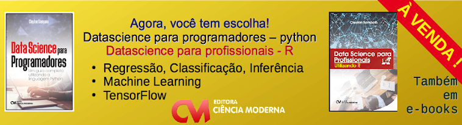
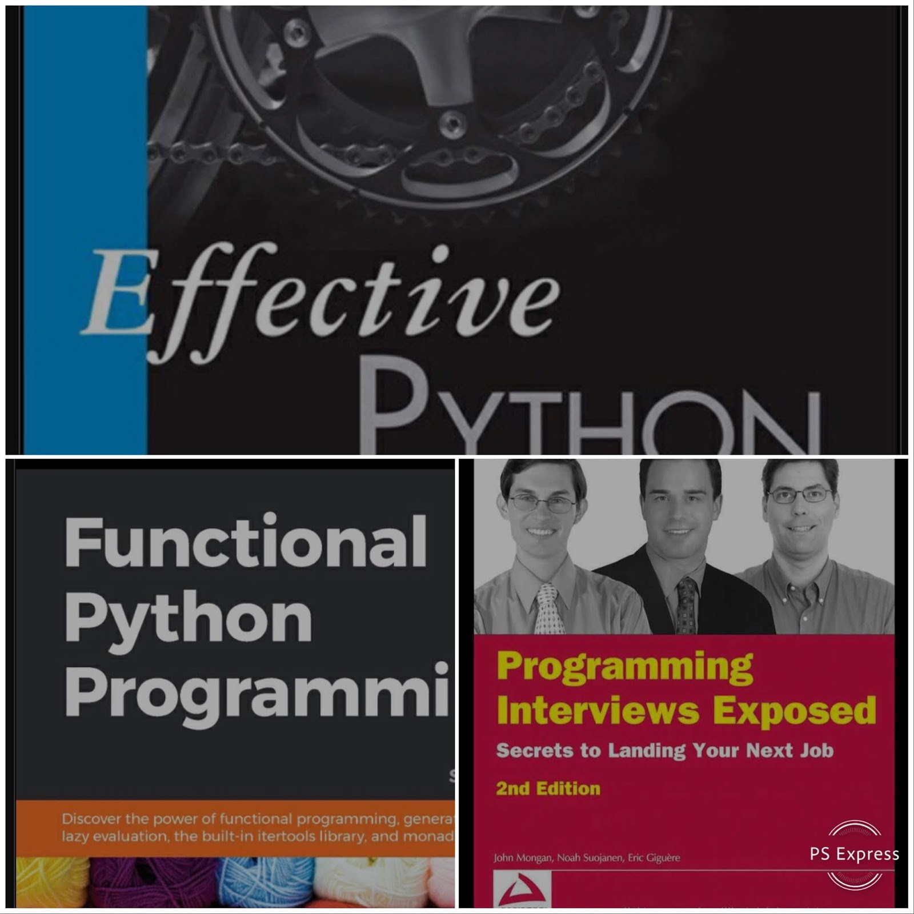

# pythondrops
## Python drops &amp; technology

(c) 2018 [**Cleuton Sampaio**](https://github.com/cleuton).

# ESTE CURSO É PATROCINADO POR:

# Curso Básico de Python

Em breve o curso estará completo, faltando apenas a última lição! O curso é baseado no **Python 3** e requer apenas que você saiba programar em qualquer outra linguagem. 
1. [Aprenda a rodar **Python**](https://github.com/cleuton/pythondrops/tree/master/curso/licao1);
2. [Introdução **quântica**](https://github.com/cleuton/pythondrops/tree/master/curso/licao2);
3. [Tipos de dados e variáveis](https://github.com/cleuton/pythondrops/tree/master/curso/licao3);
4. [Funções e módulos](https://github.com/cleuton/pythondrops/tree/master/curso/licao4);
5. [I/O básico, **JSON** e **PostgreSQL**](https://github.com/cleuton/pythondrops/tree/master/curso/licao5);
6. [Orientação a objetos](https://github.com/cleuton/pythondrops/tree/master/curso/licao6);

Curta ai o [**programa exemplo do curso**](./maze)
