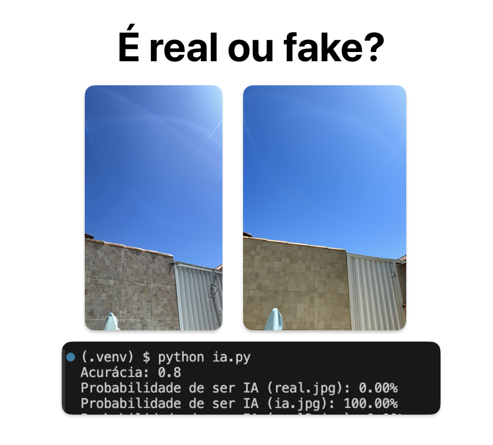

# Detector de Imagens Geradas por IA

[**Cleuton Sampaio**](https://linkedin.com/in/cleutonsampaio)

[**Repositório**](https://github.com/cleuton/pythondrops/tree/master/image_analizer)

Este código funciona como um **"detetive de imagens"** que busca pistas estatísticas para identificar se uma foto foi criada por uma câmera real ou por IA. 

## Limitações
- **Não é infalível:** Acurácia inferior a detectores modernos com redes neurais, porém mais simples, exigindo menos hardware.
- **Sensível a edições:** Compressão ou filtros podem apagar as pistas.
- **Evolução das IAs:** Modelos novos geram imagens cada vez mais realistas.

É uma **primeira camada de análise** – como um "pente fino estatístico" para triagem inicial, priorizando simplicidade e transparência.

## Técnicas

Ele usa quatro técnicas principais e um classificador, seguindo este fluxo:

### 1. Análise de Ruído Residual 
Aplica um filtro de suavização na imagem e compara com a original pois a diferença entre elas revela o "ruído residual" (pequenas imperfeições naturais).
  - **Câmeras reais** deixam um padrão de ruído único (como uma "impressão digital" do sensor). 
  - **Imagens de IA** têm ruído mais artificial ou uniforme (como uma textura "perfeita demais").

### 2. Análise de Frequências 
Divide a imagem em blocos e analisa a distribuição de detalhes finos (altas frequências) vs. áreas suaves (baixas frequências).
  - **Imagens reais** têm muitos detalhes microscópicos (como pelos ou grãos de areia). 
  - **Imagens de IA** podem perder esses detalhes ou ter padrões repetitivos (como linhas "borradas" ou texturas pouco naturais).

### 3. Análise de Cores 
Analisa estatísticas das cores (média, variação, assimetria) em três canais: brilho (Y), azul (Cb) e vermelho (Cr).
  - **Câmeras reais** capturam cores com variações naturais e imperfeitas. 
  - **Imagens de IA** podem ter cores "suavizadas" ou tons artificialmente concentrados (como um verde "perfeito" demais em folhas).

### 4. Análise de Textura 
Usa o algoritmo **LBP** para mapear padrões locais de textura (como linhas, curvas, pontos) e cria um histograma desses padrões.
  - **Texturas reais** são variadas e complexas (como a pele humana ou tecido). 
  - **Imagens de IA** podem ter padrões repetitivos ou simplificados (como um tecido "clone" em várias partes da imagem).

### 5. Classificador Final 
Combina todas as pistas coletadas em uma lista de características e treina um modelo de **Regressão Logística** para aprender a diferença entre imagens reais e de IA, gerando uma probabilidade (%) de a imagem ser artificial.
  - A Regressão Logística é simples, rápida e explicável – ideal para entender quais características são mais importantes.

### Pipeline Completo:
1. **Coleta de Dados:** Um conjunto de imagens rotuladas ("real" ou "IA") é carregado.
2. **Extração de Características:** Cada imagem passa pelas 4 análises descritas, gerando um "perfil estatístico".
3. **Treinamento:** O modelo aprende a associar esses perfis aos rótulos.
4. **Previsão:** Novas imagens são analisadas e recebem uma probabilidade de serem IA.

### Por Que Essas Técnicas Funcionam?
Imagens de IA, mesmo realistas, cometem **"erros estatísticos sutis"** que humanos não percebem, mas que algoritmos detectam:
- **Ruído artificial:** Falta da "impressão digital" natural de câmeras.
- **Falta de microdetalhes:** Simplificação de texturas complexas.
- **Cores "perfeitas demais":** Distribuições incomuns de tons.
- **Padrões repetitivos:** Texturas clonadas ou simétricas.

## Como usar

Há um diretório com várias imagens geradas por IA, fotos tiradas por mim ou imagens gratuitas do **Pixabay**. É só executar o programa. Ao final ele vai testar o modelo gerado com 2 imagens reais e 2 imagens geradas por IA. 

Para usar em "produção", salve o modelo gerado. 

## Como melhorar

**Use mais imagens.** Há poucos dados para treino e teste. Teste com pelo menos 200 imagens, 100 reais e 100 geradas por ia (aproximadamente iguais às reais). 

1. **Testar outros filtros de ruído** (Wavelet, Mediana) além do bilateral.  
2. **Adicionar entropia** às estatísticas do resíduo para medir complexidade.  
3. **Substituir FFT por DCT** na análise de frequência.  
4. **Usar máscaras de borda** (Canny) antes da análise espectral.  
5. **Expandir análise de cor** para espaços HSV ou LAB.  
6. **Balancear o dataset** (mesmo número de imagens reais e IA).  
7. **Trocar para SVM com kernel RBF** para capturar padrões não-lineares.  

