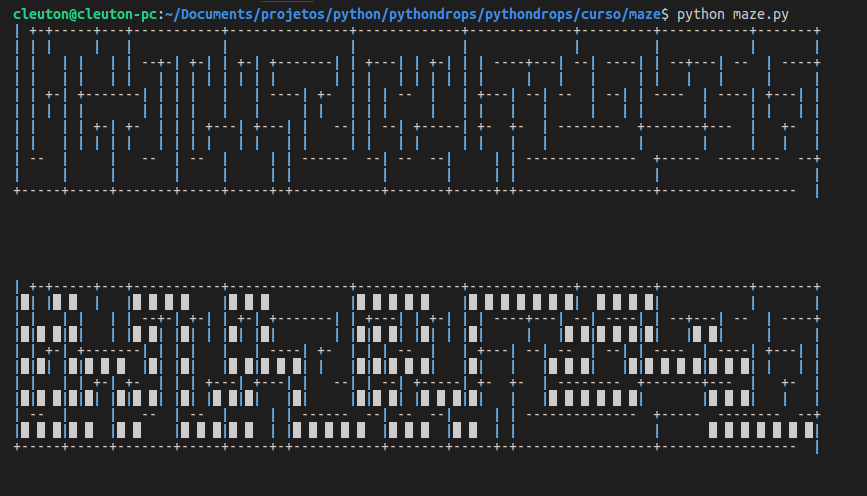
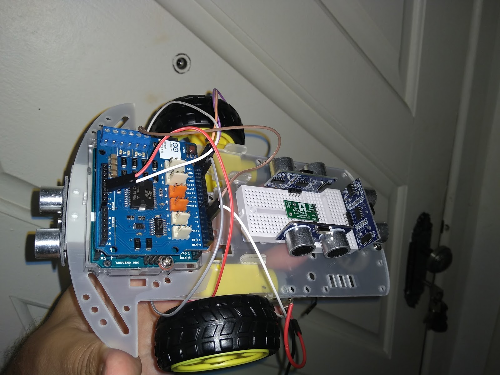

# pythondrops
## Python drops &amp; technology
**Cleuton Sampaio**

# Curso básico de python

Este é um exemplo básico de código Python, que desenha e resolve labirintos aleatórios:
```
python maze.py
```


Este código foi adaptado do meu projeto de Robô:


Este robô simples é capaz de se movimentar para a frente e para trás e fazer curvas em até 90 graus para ambos os lados. Ele possui um sensor de inércia e sensores ultrassônicos. O software de controle foi feito em Python e roda em um RaspberryPI, ligado ao Arduino via WiFi (na foto ainda utilizava cabo, depois, acrescentei um Wifi shield).

O código do **Solver** foi adaptado para simplesmente desenhar em reverso na tela, mas o algoritmo de resolução (utilizando *backtracking*) é o mesmo. 

Vou utilizar este código como exemplo básico do curso de Python.

Para quem estiver interessado no Robô, eu o estou refazendo (ele sofreu um "acidente" canino), desta vez utilizando um SoC **Omega2**, mas o software de controle continuará a ser em Python.

Ele não segue linhas, toma decisões com base nas distâncias detectadas pelos sensores óticos. 
