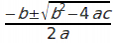

# pythondrops
## Python drops &amp; technology

(c) 2018 [**Cleuton Sampaio**](https://github.com/cleuton).

# PythonDrops 1: Módulos e Imports

*Atenção: A não ser quando claramente especificado, todo código demonstrado é escrito em python versão 3.x em diante*

## Módulos

Um módulo é um arquivo que contém código python, com uma determinada função. Podemos criar módulos para compartilhar código-fonte entre diversos programas de nossa aplicação. Vamos supor um programa que calcule as raízes de uma equação do segundo grau, segundo a fórmula de Bhaskara: 


```
import math
a = 1
b = -5
c = 6
x=(b**2)-(4*a*c)
if x<0:
        print("Raiz negativa nao pode ser extraida.")
else:
    x=math.sqrt(x)
    x1=(-b+x)/(2*a)
    x2=(-b-x)/(2*a)
print("\n\nX' = %s \nX'' = " % x1, x2)
```


Parece "legal", não? E se quisermos calcular as raízes com outros coeficientes? E se quisermos criar uma página Web e obter as raízes passando para um Servidor python? Podemos **modularizar** este programa... Por exemplo, existem pelo menos 3 módulos: 
- Obter os coeficientes;
- Calcular o delta;
- Calcular as raízes.

Vamos ver um exemplo separando os três módulos em funções:
```
import math
# Primeiro módulo (pode obter de qualquer fonte)
def obterCoeficientes():
    return 1,-5,6
# Segundo módulo
def calcDelta(a,b,c):
    delta = b**2 - 4*a*c
    if delta < 0:
        return float('nan')
    else:
        return delta
# Terceiro módulo
def calcRaizes(a,b,c):
    delta = calcDelta(a,b,c)
    if math.isnan(delta):
        print('Não possui raízes reais')
    elif delta == 0:
        raiz = -b / 2*a
        print('Possui apenas uma raiz: ',raiz)
    else:
        x1 = (-b + math.sqrt(delta)) / 2*a
        x2 = (-b - math.sqrt(delta)) / 2*a
        print('X1: ',x1,', X2: ',x2)
# Invocando os módulos
if __name__ == '__main__':
    a,b,c = obterCoeficientes()
    calcRaizes(a,b,c)
```

**```__name__```**

Sabe o que é aquele "```if __name__ == '__main__'```"? Se você executar o módulo que contém esse código, por exemplo: python script.py, ele vai executar todos os comandos imediatos que existirem dentro dele. É como se fosse um "método main()" em Java. 

O problema é que isso acontece se você importar esse módulo dentro de outro módulo... Neste caso, a execução dos comandos é indesejada.

Para evitar isso, usamos um "if" testando a variável especial "```__name__```" que contém o nome do módulo. Se ele for executado diretamente pelo python, então seu nome será "```__main__```". Caso contrário, será o seu próprio nome. Confuso? No repositório há dois arquivos: "```puro.py```" e "```importado.py```". Rode primeiro o **puro.py**:
```
python puro.py
```
O resultado deve ser: 
```
__name__ =  __main__
Rodou direto
```
Eis o módulo **puro.py**: 
```
print("__name__ = ",__name__)
if __name__ == "__main__":
    print("Rodou direto")
else:
    print("Rodou através de import")
```
Agora, vamos rodar o **importado.py** (```python importado.py```):
```
__name__ =  puro
Rodou através de import
```
Entendeu? Se importarmos um módulo dentro de outro, mesmo que ele possua funções, o python executará qualquer comando imediato (que não esteja dentro de uma função) que houver nele. Para evitarmos isso, usamos este "if" especial.

**Voltando...**

Podemos colocar cada função em um arquivo diferente: 

*coeficientes.py*
```
        def obterCoeficientes():
            return 1,-5,6
```

*cdelta.py*
```
        def calcDelta(a,b,c):
            delta = b**2 - 4*a*c
            if delta < 0:
                return float('nan')
            else:
                return delta
```

*raizes.py*
```
        import cdelta
        import math
        def calcRaizes(a,b,c):
            delta = cdelta.calcDelta(a,b,c)
            if math.isnan(delta):
                print('Não possui raízes reais')
            elif delta == 0:
                raiz = -b / 2*a
                print('Possui apenas uma raiz: ',raiz)
            else:
                x1 = (-b + math.sqrt(delta)) / 2*a
                x2 = (-b - math.sqrt(delta)) / 2*a
                print('X1: ',x1,', X2: ',x2)
```

*calculador.py*
```
        import coeficientes
        import raizes
        if __name__ == '__main__':
            a,b,c = coeficientes.obterCoeficientes()
            raizes.calcRaizes(a,b,c)

```

Na verdade, no módulo **calculador.py** esse "if" nem era muito necessário, mas é de bom tom colocar em todo módulo que possui comandos imediatos. 

É só executar: ```python calculador.py```

Os **imports** funcionarão porque os arquivos estão na mesma pasta. Se estivesse em uma subpasta, você teria que prefixar o nome "cdelta" com o nome da pasta. Mas isto veremos em outra "drop".

