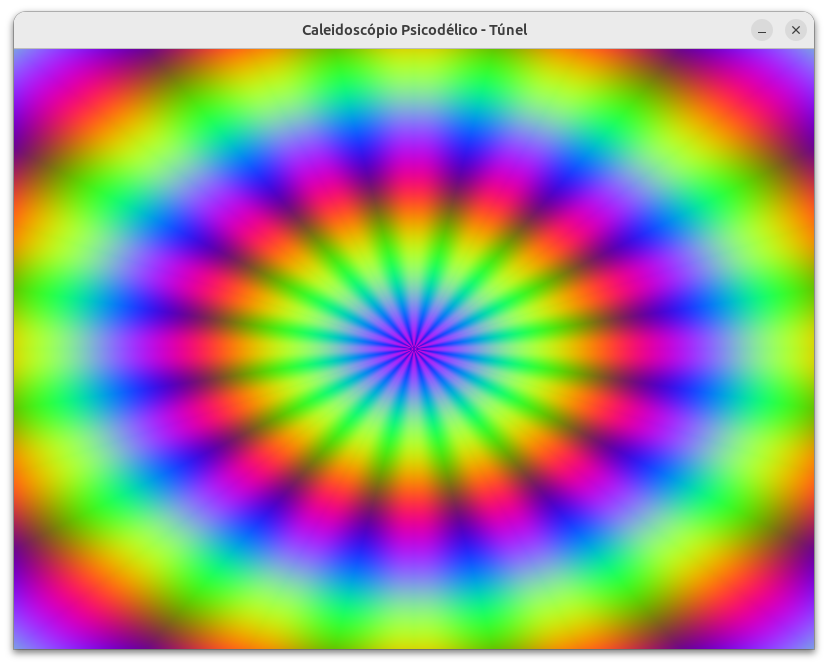

# Tunel psicodélico

[**Cleuton Sampaio**](https://linkedin.com/in/cleutonsampaio)
[**REPO**](https://github.com/cleuton/pythondrops/psycho)

Legal, né? Cara, esse foi ouvindo **Led Zeppelin**, **Deep Purple** e **Yes**... 

## A matemática

A ideia central é usar geometria polar e funções de onda para montar um túnel que se repete como num caleidoscópio e ainda “pulse” no tempo. Primeiro você cria uma grade de pontos X e Y que variam de –1 a 1, de modo que o meio da tela seja (0,0). Para cada ponto dessa grade, calcula-se:

1. **R**, a distância do ponto ao centro, usando a fórmula de círculo $R = \sqrt{X^2 + Y^2}$.
2. **Θ**, o ângulo relativo ao eixo X, com $Θ = \operatorname{atan2}(Y, X)$.

Em seguida, “dobra-se” esse ângulo em fatias iguais — se for 16 segmentos, você pega o ângulo original e aplica um módulo para repetir o padrão a cada $2\pi/16$. Ainda faz um valor absoluto para simular o reflexo de um caleidoscópio, como se cada fatia fosse um espelho.

Com o raio e o ângulo dobrado em mãos, gera-se dois padrões de onda:

* Um componente radial: $\sin(10 R - 4 t)$, que cria anéis que parecem avançar no túnel.
* Um componente angular: $\sin(16 Θ_{\text{dobrado}} + 6 t)$, que gera as “pétalas” giratórias conforme o túnel se move.

Você soma esses dois sinais e normaliza de –1…1 para 0…255, obtendo um padrão em escala de cinza. Para fazer as cores, repete a função seno sobre R com deslocamentos de fase (por exemplo +2 e +4 radianos) para os canais verde e azul. Cada pixel vira então um triplete RGB com tonalidades que se alternam no tempo.

O resultado é um mosaico de ondas radiais e angulares, espelhado em triângulos, e animado pelo termo que depende de “tempo”. É essa combinação de coordenadas polares, dobra angular e funções seno com fases diferentes que cria a ilusão de estar viajando por um túnel psicodélico.

## A implementação

Aqui está uma explicação passo a passo, em linguagem simples, de como o código em Python foi montado e de como ele gera e renderiza o efeito de túnel caleidoscópico:

1. **Bibliotecas usadas**

   * **Pygame**: é o motor que abre uma janela, captura eventos (teclado, mouse, fechar) e coloca pixels na tela.
   * **NumPy**: gera e manipula matrizes numéricas de forma muito rápida, o que é essencial para calcular milhares de pixels a cada quadro.
   * **math** e **sys**: usam funções matemáticas (seno, arco-tangente, raiz quadrada) e permitem encerrar o programa corretamente.

2. **Inicialização da janela**
   A função `iniciar_pygame(largura, altura)` chama `pygame.init()` para ativar todos os módulos do Pygame e depois `pygame.display.set_mode()` para criar uma janela com as dimensões desejadas. Essa mesma função ajusta o título da janela para algo descritivo (“Caleidoscópio Psicodélico – Túnel”).

3. **Criação da malha de coordenadas**
   Logo em seguida, `gerar_malha(largura, altura)` constroi dois arrays 2D, `X` e `Y`, com valores que vão de –1 a 1. Cada posição nesses arrays corresponde a uma coordenada normalizada da tela, de modo que o centro fique em (0,0) e as bordas em ±1.

4. **Transformação para coordenadas polares**
   A cada quadro, calculamos para todo ponto da malha:

   * **R** = distância do ponto ao centro, via $\sqrt{X^2 + Y^2}$.
   * **Θ** = ângulo do ponto em relação ao eixo X, via `atan2(Y, X)`.

5. **Efeito caleidoscópio**
   Para simular o reflexo múltiplo de um caleidoscópio, dividimos 360° em N segmentos iguais (por exemplo 16). Tomamos `Θ mod (2π/N)`, espelhamos em cada fatia e daí surge o padrão repetido em “gomos”.

6. **Geração dos padrões de onda**
   Usamos duas senóides:

   * Uma depende de `R` e do tempo (`sin(10·R – 4·t)`), formando anéis que parecem avançar.
   * A outra depende de `Θ_dobrado` e do tempo (`sin(N·Θ_dobrado + 6·t)`), criando as “pétalas” giratórias.
     Somando e normalizando ambos, obtemos um mapa em tons de cinza entre –1 e 1, que depois convertemos para 0–255.

7. **Colorização psicodélica**
   Para virar RGB, reutilizamos o mesmo mapa de tons de cinza mas com deslocamentos de fase diferentes para cada canal: vermelho sem deslocamento, verde com +2 radianos, azul com +4. Isso produz aquela mistura de cores vibrantes que “dançam” de maneira independente.

8. **Montagem e correção do array**
   NumPy cria uma matriz `imagem` de forma `(altura, largura, 3)`. O Pygame, porém, espera que o array seja `(largura, altura, 3)` ao usar `surfarray.blit_array`. Por isso aplicamos `np.transpose(imagem, (1, 0, 2))` para trocar eixo e alinhar corretamente.

9. **Renderização na tela**
   Com o array já na ordem certa, chamamos `pygame.surfarray.blit_array(tela, imagem_corrigida)` para copiar cada pixel para a Surface interna do Pygame. Em seguida `pygame.display.flip()` atualiza a janela de uma vez, mostrando o novo quadro.

10. **Loop principal e controle de FPS**
    No `while True` do `main()`, lemos os eventos (pra detectar o “fechar janela”), calculamos o tempo decorrido (em segundos) e chamamos `atualizar_frame`. Um `Clock.tick(30)` limita a 30 quadros por segundo, garantindo um movimento suave sem sobrecarregar a CPU.

Combinamos coordenadas polares, operações vetorizadas do NumPy e senóides dependentes de tempo para criar um padrão que se repete e se move, e o Pygame cuida de exibir esses pixels de forma eficiente em uma janela interativa.
