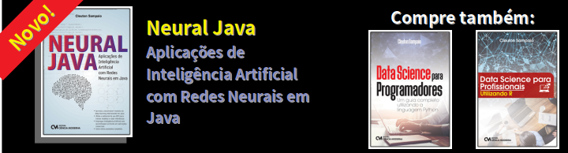

# pythondrops
## Python drops & technology

(c) 2018 [**Cleuton Sampaio**](https://github.com/cleuton).

# PythonDrops 7: Python, GIL e paralelismo

Bom, neste artigo vou mostrar a você um pouco das idiossincrasias do Python e seus efeitos no seu projeto de software. Veremos uma característica curiosa, o **GIL - Global Interpreter Lock**, e como podemos contorná-lo. 

O fonte do texto está no [**Bom Programador**](http://www.obomprogramador.com/2019/03/python-paralelismo-e-gil-nem-tudo.html)
