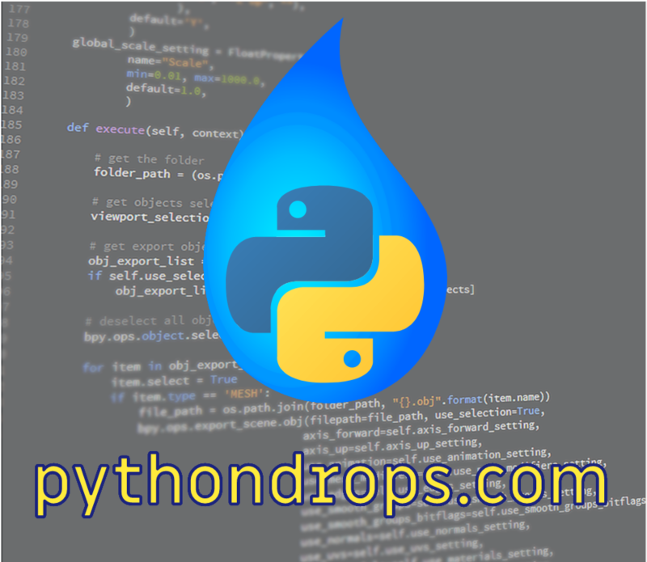

[**Cleuton Sampaio**](https://linkedin.com/in/cleutonsampaio).

# RESTful service em Python

Este é um exemplo simples, mas com boas práticas de projeto e implementação de servidores REST em Python. O foco é criar uma
aplicação simples, com camadas bem definidas e boas práticas para servir de base para qualquer outro projeto. 

Neste exemplo não utilizamos **ORM** para dar ideia de como deve funcionar da maneira mais básica possível. É um projeto simples.

## Antes de mais nada

Crie um **ambiente virtual** para poder instalar suas dependências sem "sujar" seu ambiente real: 

```shell
python -m venv .venv
source .venv/bin/activate
pip install -r requirements.txt
```

Suba um contêiner para ser o database, já rodando o script de inicialização: 

```shell
cd database
docker run -d \
  --name meu_postgres \
  -e POSTGRES_USER=postgres \
  -e POSTGRES_PASSWORD=postgres \
  -p 5432:5432 \
  -v "$(pwd)/init.sql":/docker-entrypoint-initdb.d/init.sql \
  postgres:latest
```

Agora, suba o servidor e rode os testes de API: 

```shell
cd .. 
gunicorn server:app
```

Abra outro terminal e vá para a pasta do projeto: 

```shell
cd tests
shell ./api_tests.sh
```

Tudo deve funcionar sem problemas. Você também pode executar os testes (unitário e de integração):

```shell
cd .. # se não estiver na raiz do projeto
python -m unittest discover -s tests
```

## Estrutura do projeto

Este projeto tem 3 camadas distintas de código: 

WSGI
  |
  +--web: **Wrapper** (embrulho) web da aplicação. Não contém lógica de negócio, só de web.
  +--services: **Miolo** da aplicação. Só contém lógica de negócio. Não contém nada de web e nem de database.
  +--db: **Persistência** da aplicação. Só contém lógica de persistência. Nada sabe sobre negócio e nem web. 

A camada **wsgi** é a raiz do projeto e contém o script `server.py`, cuja função é expor um objeto para que o servidor `gunicorn` possa iniciar a aplicação. 

> **WSGI**: Web Server Gateway Interface é um padrão da especificação Python que define uma interface simples entre servidores web e aplicativos ou frameworks Python, permitindo que eles se comuniquem de forma consistente. Ele funciona como um intermediário, onde o servidor web (como Gunicorn ou uWSGI) lida com as requisições HTTP e as repassa para a aplicação Python através de uma chamada de função padronizada, e a aplicação responde ao servidor no mesmo formato. Isso garante portabilidade e compatibilidade entre diferentes frameworks e servidores Python.

> **Gunicorn** Green Unicorn é um servidor WSGI Python que atua como um intermediário eficiente entre aplicativos web Python e o servidor web (como Nginx). Ele gerencia a execução de aplicativos WSGI, oferecendo suporte a múltiplos processos simultâneos, escalabilidade e fácil configuração, sendo amplamente utilizado para hospedar frameworks web como Flask e Django. É conhecido por sua simplicidade, desempenho robusto e capacidade de se integrar facilmente em ambientes de produção.

### Camada de persistência

A camada de persistência é responsável por criar um **pool de conexões** com o banco de dados e executar comandos SQL, retornando os resultados em um formato independente (**modelo**). 

- **connection_pool.py**: Módulo responsável por inicializar um pool de conexões com o **Postgres** e retornar uma conexão para ser utilizada. Também oferece métodos para liberar uma conexão utilizada e fechar todas as conexões. 

- **models.py**: Classes que representam as tabelas e seus relacionamentos. Servem para trafegar entre as camadas do sistema, de forma independente de protocolo. 

- **queries_script.py**: Uma classe que contém uma propriedade para cada query declarada em SQL. Assim, evitamos inserir código SQL dentro das classes de persistência, mantendo todo o SQL em um só lugar, e podendo evitar erros de runtime. Poderia ser um arquivo `toml` ou de `propriedades`, mas poderíamos errar o nome e só veríamos isso em runtime. 

- **dao**: Oferece métodos para que as classes da camada `services` solicitem operações de database. 

Esta camada isola o resto da aplicação da parte de banco de dados.

> **Nota**: Somente as classes da camada **services** podem acessar métodos de **dao**. As outras podem apenas utilizar os **models**.

### Camada de serviços

A camada **services** (de serviços) contém a lógica da aplicação. Ela não pode depender de nada das outras camadas, exceto as interfaces bem definidas e os modelos. As classes nessa camada não devem saber se estão em um sistema web e nem qual é o mecanismo de persistência utilizado. 

- **pessoa_service.py**: Temos uma classe de serviço para cada **entidade forte**. Uma entidade forte tem sua existencia auto definida, não dependendo de ninguém. Neste exemplo, apenas a **Pessoa** é entidade forte. Deve oferecer métodos para que a camada de **UI** (**web**, **mobile** ou **REST**) interaja com os recursos expostos pela aplicação. 

## Camada web

Neste caso, estamos expondo uma série de recursos (Pessoa e Dependente) via **HTTP/REST**, portanto, precisamos criar uma classe com **rotas** a serem expostas via HTTP. 

- **app.py**: Cria a classe `app` que expõe as rotas HTTP/REST através do **gunicorn**. Esta classe só se comunica com as classes da camada **services** e utiliza os modelos expostos pela camada **db**, que são classes gerais **POPO** (Plain Old Python Objects), totalmente desacoplada de protocolos específicos de qualquer camada. 

## Elementos de configuração

### Credenciais de acesso 

Senhas, database, username etc não podem ficar dentro do código-fonte e nem dentro de arquivos de configuração. Este é um erro grosseiro, uma grande falha de segurança. Na falta de mecanismos melhores (**Kubernetes secrets**, por exemplo) melhor utilizar variáveis de ambiente. E use valores `default` que nada tenham a ver com a configuração de **produção**. Isso é feito no módulo `db/connection_pool.py`: 

```python
# Exemplo de variáveis de ambiente
DB_HOST = os.getenv('DB_HOST', 'localhost')
DB_PORT = os.getenv('DB_PORT', '5432')
DB_NAME = os.getenv('DB_NAME', 'postgres')
DB_USER = os.getenv('DB_USER', 'postgres')
DB_PASS = os.getenv('DB_PASS', 'postgres')

class DatabasePool:
    __pool = None

    @staticmethod
    def initialize(minconn=1, maxconn=5):
        if DatabasePool.__pool is None:
            DatabasePool.__pool = psycopg2.pool.SimpleConnectionPool(
                minconn,
                maxconn,
                host=DB_HOST,
                port=DB_PORT,
                database=DB_NAME,
                user=DB_USER,
                password=DB_PASS
            )
```

Evite acessar essas informações via `command line arguments` pois isso pode tentar as pessoas a escreverem os comandos para rodar a aplicação, informando as variáveis sensíveis. 

### Mensagens

Textos de mensagens devem estar centralizados em um só local. O melhor seria que ficassem em um meio externo, mas com **enums** contendo as chaves de acesso. O uso de enuns ou constantes é recomendado para evitar erros em runtime, pois, se você errar a chave, já dá erro logo na compilação. 

> **Nota**: O Python não realiza uma compilação completa do código no sentido tradicional, como em linguagens compiladas (C, Java), mas converte o código em **bytecode** antes da execução. No entanto, erros como `SyntaxError` ou problemas básicos de indentação são detectados durante essa conversão inicial. Erros mais complexos, como `NameError`, `TypeError`, ou problemas de importação, só serão detectados **durante a execução** do trecho específico de código. Isso significa que é possível implementar e implantar código com partes não testadas ou quebradas, e esses problemas só se manifestarão quando as partes problemáticas forem executadas. Esse comportamento pode levar a falhas em produção se o código não for bem testado previamente. A boa prática para mitigar isso é utilizar **testes automatizados abrangentes** (unitários, de integração e de sistema), além de ferramentas de análise estática, como o `mypy` e linters (`flake8`, `pylint`), que ajudam a detectar problemas antes da execução.

Se você colocar as mensagens em um arquivo de **properties** ou melhor: **toml**, é muito bom. Pode até criar código para converter cada chave em um atributo da classe de mensagens. Mas, como esses atributos são associados dinâmicamente, não há verificação em tempo de compilação e você pode ter problemas. Então, crie constantes com as chaves dessas mensagens. 

Criar arquivos separados também ajuda na **l10n** (localização) e na **i18n** (internacionalização) da aplicação, além de evitar inconsistência entre pontos diferentes do código mostrando mensagens similares. 

A minha solução aqui foi bem mais simples e prática: Criei classes com os atributos pré-fixados. Exemplo: 

```python
class Mensagens:
    def __init__(self, **kwargs):
        self.erro_inserir_pessoa = "Erro ao inserir pessoa: "
        self.pessoa_sem_id = "Pessoa não possui ID para atualizar."
        self.erro_atualizar_pessoa = "Erro ao atualizar pessoa: "
        ...
``` 

Feio? Talvez. Mas funciona mesmo. E fica um arquivo simples que pode ser alterado sem espalhar alterações pelo código principal. Se você criasse um arquivo **toml** ou **properties** também teria que alterar o projeto, com a desvantagem de não pegar erros em compilação. 

### Queries SQL

Ter comandos **SQL** embutidos no código é problemático. Além da duplicidade (você pode precisar do mesmo SQL em pontos diferentes), pode gerar inconsistências e dificuldades para atualização. Também cria maior dificuldade de portabilidade da aplicação para SGBDs diferentes. Você pode fazer como fez com as mensagens: 

```python
class Queries:
    def __init__(self):
        self.select_pessoas = "SELECT id, nome FROM pessoa"
        self.insert_pessoa = "INSERT INTO pessoa (nome) VALUES (%s) RETURNING id"
        self.update_pessoa = "UPDATE pessoa SET nome = %s WHERE id = %s"
        self.delete_pessoa = "DELETE FROM pessoa WHERE id = %s"
        self.select_pessoa = "SELECT id, nome FROM pessoa WHERE id = %s"
        self.select_pessoa_dependentes = """
                        SELECT id, nome, nascimento, parentesco, id_pessoa 
                        FROM dependente 
                        WHERE id_pessoa = %s
                        """
        ...
```

Colocar as queries em arquivos **toml** ou **properties** gera as mesmas questões das mensagens. 

## Erros

Jamais use `println`! Use `log` e centralize a configuração!

Teste sempre os erros que podem acontecer e deixe passar só se tiver tratamento na camada superior. Sempre registre no `log` o que aconteceu de relevante. 

O módulo `logger_config.py` centraliza a configuração de log para toda a aplicação: 

```python
import logging

# Configuração Global do Logger
def setup_logger():
    logger = logging.getLogger("MinhaAplicacao")  # Nome global para o logger
    logger.setLevel(logging.DEBUG)  # Define o nível global de log

    # Handler para console
    console_handler = logging.StreamHandler()
    console_handler.setLevel(logging.INFO)

    # Handler para arquivo
    file_handler = logging.FileHandler("app.log")
    file_handler.setLevel(logging.DEBUG)

    # Formato dos logs
    formatter = logging.Formatter('%(asctime)s - %(name)s - %(levelname)s - %(message)s')
    console_handler.setFormatter(formatter)
    file_handler.setFormatter(formatter)

    # Adicionando os handlers ao logger
    logger.addHandler(console_handler)
    logger.addHandler(file_handler)

    return logger


# Configurando o logger global
logger = setup_logger()
```

## Testes

Toda aplicação tem pelo menos 3 tipos de testes: 

- **Testes unitários**: Geralmente utilizados para classes da camada **service**.
- **Testes de integração**: Utilizados para validar os services em conjunto com a **persistência**.
- **Testes E2E ou de API**: Se você tem uma app web com **frontend**, então pode criar testes end-to-end, que vão do navegador até o database. Para projetos **REST** como este, criamos testes de **API** utilizando softwares como **Postman** ou **Insomnia**. No nosso caso aqui, criamos um shell script com cada request. Você pode criar um script **Python** com a biblioteca **requests** para isso, testando mais apropriadamente cada retorno. 

O importante é que os testes unitários devem testar apenas um método de uma classe, simulando (**mock**) tudo o que está fora. Se você separou a **persistência** da camada de **service** é muito simples fazer isso, bastando simular a classe **dao**. 

Algumas classes são muito difíceis de testar unitariamente, como a classe **dao**, pois isso significaria ter que **mockar** classes de terceiros, como as do **database**. Então é melhor deixar para testá-las com os testes de integração, que utilizam o database. 

Classes da camada **web** também são difíceis de testar unitariamente. Testes **E2E** ou de **API** são mais simples e eficazes. 

Isso bate com o raciocínio geral sobre decisões, que são a parte mais complexa da aplicação: 

- **Services**: Tomam as decisões de negócio e precisam ser testados unitariamente, forçando valores limítrofes e várias situações diferentes combinadas. 

- **Persistência**: Idealmente não precisa tomar muitas decisões, especialmente decisões de negócio, que devem ser deixadas para a camada **services**. Podem ser testadas de forma integrada. 

- **Web**: Da mesma forma, devemos evitar decisões de negócio nesta camada. Até mesmo validações mais complexas deveriam ser feitas pela camada **services**. Ela pode ser testada **E2E** ou de forma integrada. 

## Mapeamento objeto-relacional

Como deve ter notado, não utilizei um **ORM** neste exemplo.

> Um **ORM** (Object-Relational Mapping) em Python é uma ferramenta que permite interagir com bancos de dados relacionais utilizando objetos e classes em vez de consultas SQL tradicionais. Ele mapeia tabelas do banco de dados para classes Python, colunas para atributos, e fornece métodos para realizar operações como inserir, atualizar, deletar e buscar dados diretamente através de objetos Python. Isso simplifica o desenvolvimento, abstraindo a complexidade do SQL e promovendo maior legibilidade e manutenção do código. Exemplos populares de ORMs em Python incluem SQLAlchemy e Django ORM.

ORMs acrescentam outra camada de complexidade e indireção sobre a camada normal de persistência, requerendo que o desenvolvedor se adapte a eles. Além disso, "mascaram" o acesso a dados muitas vezes levando a soluções de persistência de baixa performance. O que dáo de facilidade com uma mão, tomam com a outra. 

Para quem está iniciando, a melhor saída é aprender a acessar o database sem ORM algum. 

**Mas como vamos trafegar dados pelas camadas?**
Boa pergunta... No Python, a biblioteca **psycopg2** retorna os resultados das queries na forma de listas ou tuplas ou listas de tuplas. Podemos sim trafegar esses objetos pelas camadas, porém falta o **contexto** dos dados! Esses objetos não possuem um `esquema` e fica difícil advinhar em qual posição está qual campo. 
Por isso criamos classes de **modelo**, que são instanciadas com dados vindos das tabelas dentro da camada de **persistência** e retornadas para as outras camadas. 

**E os relacionamentos?**
Outra boa pergunta... Aqui, temos que lidar com coisas como **many-to-one** dentro do **dao**. Se você tem uma entidade que possui outras entidades (cardinalidade 1-n ou 0-n), tem que resolver isso no seu DAO. Você pode retornar a coleção já populada na classe proprietária ou não, dependendo da frequência que esses dois dados são utilizados juntos. 
No exemplo eu separei as duas coisas: Você pode obter uma `Pessoa` e depois obter seus `Dependentes` em separado. 

**E o many-to-many?**
A mesma coisa! Como você resolve um relacionamento many-to-many em um database? Com uma tabela associativa. Depois é só implementar a cardinalidade e a direção do relacionamento no seu ORM.

# Como executar o database e a aplicação em contêineres Docker

Crie um Dockerfile para sua aplicação Python, juntamente com instruções para conectar ao banco de dados:

```Dockerfile
# Dockerfile
FROM python:3.9-slim

# Define variáveis de ambiente para o PostgreSQL
ENV DB_HOST=meu_postgres
ENV DB_PORT=5432
ENV DB_USER=postgres
ENV DB_PASSWORD=postgres
ENV DB_NAME=postgres
ENV FLASK_APP=server.py
ENV FLASK_ENV=development

WORKDIR /app

# Instala dependências do sistema para psycopg2
RUN apt-get update && apt-get install -y \
    libpq-dev \
    gcc \
    && rm -rf /var/lib/apt/lists/*

# Instala dependências do Python
COPY requirements.txt .
RUN pip install --no-cache-dir -r requirements.txt

# Copia toda a aplicação
COPY . .

EXPOSE 5000

CMD ["flask", "run", "--host=0.0.0.0"]
```

**requirements.txt** (deve incluir as dependências necessárias):
```
Flask==2.0.3
psycopg2-binary==2.9.3
```

Para executar a aplicação, siga estes passos:

1. Primeiro crie uma rede Docker para os containers se comunicarem:
```bash
docker network create minha-rede
```

2. Execute o container do PostgreSQL na rede criada:
```bash
docker run -d \
  --name meu_postgres \
  --network minha-rede \
  -e POSTGRES_USER=postgres \
  -e POSTGRES_PASSWORD=postgres \
  -p 5432:5432 \
  -v "$(pwd)/init.sql":/docker-entrypoint-initdb.d/init.sql \
  postgres:latest
```

3. Construa a imagem da aplicação Python:
```bash
docker build -t minha-app-python .
```

4. Execute o container da aplicação Python na mesma rede:
```bash
docker run -d \
  --name minha-app \
  --network minha-rede \
  -p 5000:5000 \
  minha-app-python
```

Principais pontos de configuração:

1. **Rede Docker**: Ambos containers devem estar na mesma rede para se comunicarem usando os nomes dos serviços

2. **Variáveis de Ambiente**:
   - `DB_HOST`: Nome do container do PostgreSQL (`meu_postgres`)
   - `DB_PORT`: Porta padrão do PostgreSQL
   - `DB_USER` e `DB_PASSWORD`: Credenciais definidas no container do Postgres
   - `FLASK_*`: Configurações do Flask

3. **Dependências**:
   - `libpq-dev` e `gcc` são necessários para compilar o psycopg2
   - `psycopg2-binary` para conexão com PostgreSQL

4. **Comunicação**:
   - A aplicação Python acessará o banco de dados usando `meu_postgres:5432`
   - O Flask é configurado para escutar em `0.0.0.0` para aceitar conexões externas

Certifique-se que seu arquivo `init.sql` cria o banco de dados e tabelas necessárias, e que o connection pool na aplicação está usando as variáveis de ambiente definidas para configurar a conexão com o banco de dados.
