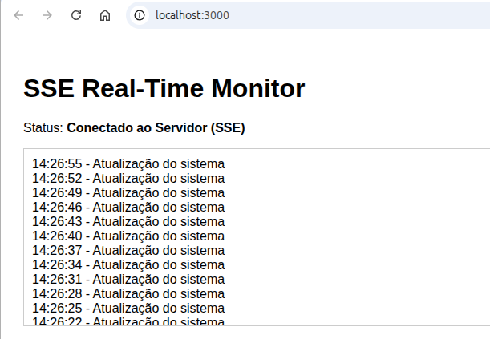

# SSE & Long-Lived Connections Project

Este projeto demonstra a implementação de **Server-Sent Events (SSE)** utilizando um ecossistema moderno: **FastAPI** para o backend e **React** para o frontend.

## Conceitos Fundamentais

### O que são Long-lived Connections?

Tradicionalmente, a web funciona no modelo *Request-Response*: o cliente pede algo, o servidor responde e a conexão fecha.
As **Long-lived Connections** (Conexões de Longa Duração) quebram esse paradigma. Elas mantêm um canal aberto entre cliente e servidor, permitindo que os dados fluam continuamente sem a necessidade de renegociar a conexão (handshake) a cada nova informação.

#### 1. Iniciação do Servidor: Otimização do Protocolo HTTP

O servidor inicia a conexão de longa duração simplesmente alterando a semântica da resposta HTTP padrão, sem mudar de protocolo.

* **Content-Type:** O servidor envia `Content-Type: text/event-stream`. Isso avisa ao navegador que a resposta não é um documento estático, mas um fluxo contínuo de dados.
* **Persistent Connection (Keep-Alive):** O servidor utiliza o mecanismo nativo do HTTP/1.1 (ou frames do HTTP/2) para manter o socket TCP aberto. Ele não envia o caractere de terminação de corpo de mensagem que normalmente sinalizaria o fim da requisição.
* **Flush Imediato:** O servidor precisa garantir que o buffer de saída seja liberado (flushed) imediatamente após cada `yield`, caso contrário, os dados ficariam presos no buffer do servidor até acumularem um tamanho específico, destruindo o "tempo real".

#### 2. O Papel do Cliente: Manutenção e Resiliência

Para o cliente, o segredo da "longa duração" reside na implementação da interface `EventSource` no motor do navegador:

* **Leitura Incremental:** O navegador não espera o fim da requisição para processar os dados. Ele lê o socket TCP em partes (chunks). Sempre que encontra a sequência de bytes `\n\n` (dois line feeds), ele dispara o evento no JavaScript.
* **Gerenciamento de Estado de Conexão:** O navegador monitora o estado do socket TCP. Se o socket for fechado (receber um pacote `FIN` ou `RST`), a API `EventSource` não encerra o objeto; ela muda seu estado interno para `CONNECTING`.
* **Reconexão Automática e Continuidade:** O cliente agenda uma nova requisição HTTP silenciosa. Para garantir a continuidade, o navegador envia o cabeçalho `Last-Event-ID` contendo o ID do último evento processado com sucesso. Isso permite que o servidor faça o "catch-up" dos dados perdidos durante a queda.

O **HTTP/2** resolve o maior gargalo do SSE no HTTP/1.1: o limite de conexões por domínio (geralmente 6).

#### Como o HTTP/2 melhora o SSE

* **Multiplexação:** No HTTP/1.1, cada stream SSE ocupava um socket TCP inteiro. Se você tivesse 6 abas abertas com SSE, o navegador não conseguia carregar mais nada do seu site. No HTTP/2, múltiplos streams SSE viajam dentro de uma **única conexão TCP** em "frames" binários diferentes.
* **Eficiência de Recursos:** Reduz drasticamente o overhead de abertura de conexões (handshakes TCP/TLS) e o consumo de memória no servidor e no cliente.
* **Priorização:** O protocolo permite que o navegador dê prioridade a recursos críticos (como CSS/JS) enquanto o stream SSE continua rodando em segundo plano.

No HTTP/1.1, o SSE é um **"Hanging GET"** que bloqueia um slot de conexão. No HTTP/2, o SSE é apenas mais um **Stream ID** dentro de um túnel binário já estabelecido, eliminando o limite de concorrência e o custo de novos sockets.

#### E como rodar com HTTP/2?

Para rodar o FastAPI com **HTTP/2**, o Uvicorn exige o uso de **SSL/TLS**, pois os navegadores modernos não suportam multiplexação em conexões não criptografadas.

##### 1. Requisitos

Você precisará da biblioteca `httptools` e de certificados (mesmo que autoassinados).

```bash
pip install uvicorn[standard]

```

##### 2. Configuração no Python

No seu arquivo `main.py` (ou via CLI), você deve apontar para os arquivos de certificado:

```python
if __name__ == "__main__":
    import uvicorn
    uvicorn.run(
        "main:app",
        host="0.0.0.0",
        port=8443,
        ssl_keyfile="./key.pem",
        ssl_certfile="./cert.pem",
        http="h2"  # Força o suporte a HTTP/2
    )

```

##### 3. Impacto

* **Binary Framing:** O HTTP/2 fragmenta as mensagens SSE em frames binários pequenos. Isso evita que um stream "entupa" a conexão, permitindo que outros dados (imagens, scripts) passem simultaneamente.
* **Header Compression (HPACK):** Os headers repetitivos do SSE são compactados, economizando largura de banda em conexões de longa duração que sofrem muitas reconexões.

#### Resumo

Com HTTP/2 + SSL, o limite de 6 conexões SSE por domínio desaparece. O usuário pode abrir dezenas de abas do seu dashboard sem travar o carregamento do restante do site, tudo sobre um único túnel TCP.

### Server-Sent Events (SSE) vs WebSockets

* **SSE:** É um padrão HTTP que permite ao servidor "empurrar" dados para o cliente de forma unidirecional. É muito mais simples de implementar e consome menos recursos se você não precisa que o cliente envie dados de volta pelo mesmo canal.
* **WebSockets:** É um protocolo bidirecional (Full-Duplex). É mais robusto para chats ou jogos, mas exige mais do servidor e de configurações de rede (proxies/firewalls).

## Como Executar

### Backend

1. Navegue até a pasta `backend`.
2. Crie um ambiente virtual: `python -m venv .venv` e ative: `source .venv/bin/activate`.
3. Instale as dependências: `pip install -r requirements.txt`.
4. Execute o servidor: `python main.py`.

### Frontend

1. Navegue até a pasta `frontend`.
2. Instale as dependências: `npm install`.
3. Inicie o projeto: `npm start`.



## Por que usar SSE neste projeto?

1. **Reconexão Automática:** O navegador tenta reconectar sozinho se o servidor cair.
2. **Protocolo Leve:** Funciona sobre o protocolo HTTP padrão (porta 80/443).
3. **Eficiência:** Perfeito para dashboards, notificações e feeds onde o servidor é a fonte da verdade.


## Constatação de SSE e Long-lived Connections

Para validar a natureza da conexão de longa duração deste projeto, você pode observar os seguintes comportamentos técnicos no seu navegador (Chrome/Edge/Firefox):

### 1. Inspeção do Fluxo de Rede (Network)

Ao abrir o **Developer Tools (F12)** e navegar até a aba **Network**, filtre por `Fetch/XHR` ou `EventStream`. Ao clicar no endpoint `/stream`, você notará:

* **Status Permanente:** A requisição não termina. O status permanecerá como "Pending" ou o tempo de carregamento continuará subindo indefinidamente.
* **Headers de Resposta:** O servidor confirma o uso de SSE através dos cabeçalhos:
* `Content-Type: text/event-stream` — Indica que o corpo da resposta é um fluxo contínuo de dados.
* `Cache-Control: no-cache` — Impede que intermediários (proxies) armazenem os dados.
* `Connection: keep-alive` — Mantém o socket TCP aberto.

### 2. O Formato dos Dados (Frames)

Diferente de uma resposta JSON comum que vem em um bloco único `{...}`, o SSE envia "chunks" (pedaços). Na aba **EventStream** (dentro da requisição no Network), você verá cada mensagem chegando como um evento individual. O formato bruto que viaja pela rede é:

```text
id: message_1
event: message
data: 14:30:05 - Atualização do sistema

```

### 3. Prova de Resiliência (Reconexão Automática)

A maior evidência da robustez de uma **Long-lived Connection** gerenciada pelo protocolo SSE é a sua capacidade de auto-recuperação:

1. **Derrube o Servidor:** Pare o processo Python (`Ctrl+C`). No console do React, você verá o erro de conexão.
2. **Mecanismo de Retentativa:** O objeto `EventSource` no navegador entrará automaticamente em estado de `CONNECTING`. Ele tentará restabelecer o canal HTTP sem nenhuma linha de código adicional no frontend.
3. **Recuperação:** Assim que o servidor Python for reiniciado, o navegador completará o novo "Handshake" e o fluxo de dados será retomado instantaneamente, provando que o cliente está programado para manter a conexão viva o tempo todo.

## Diferenciais da Implementação

* **Heartbeat Nativo:** O servidor envia pings silenciosos (comentários `:`) para evitar que timeouts de infraestrutura (como Nginx ou Cloudflare) encerrem a conexão por inatividade.
* **Backpressure Handling:** O uso de `async/await` no FastAPI garante que, se o cliente estiver lento para processar, o servidor não trave, liberando recursos para outros usuários.

