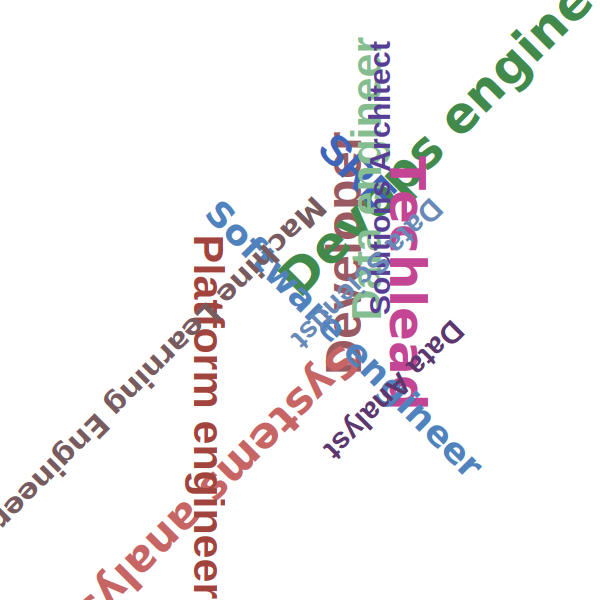

# Tag cloud

[**Cleuton Sampaio**](https://linkedin.com/in/cleutonsampaio)

Repositório: [https://github.com/cleuton/pythondrops/tree/master/tagcloud](https://github.com/cleuton/pythondrops/tree/master/tagcloud)

Gerar **tag cloud** não é muito simples. Eu jamais encontrei um bom gerador e acabei criando o meu próprio. É um bom exercício em **python**. 

Ainda é um `work in progress` mas tem me ajudado bastante. 

Aqui está o código-fonte: 

```python
#!/usr/bin/env python3
import svgwrite
import random
import argparse
import math
from collections import Counter

def gerar_nuvem_tags(tags,
                      arquivo_saida='nuvem_tags.svg',
                      largura=600,
                      altura=600,
                      cor_fundo=None,
                      familias_fonte=None,
                      angulos=None,
                      paleta_cores=None,
                      tamanho_fonte_min=30,
                      tamanho_fonte_max=50):
    """
    Gera uma nuvem de tags com leve variação de tamanho e rotação completa (inclusive invertida).
    Palavras bem distribuídas e centralizadas.
    """

    # Conta frequências
    frequencias = Counter(tags)
    if not frequencias:
        print("Nenhuma tag fornecida.")
        return

    max_freq = max(frequencias.values())
    min_freq = min(frequencias.values())

    # Configurações padrão
    if familias_fonte is None:
        familias_fonte = ['Arial', 'Verdana', 'Helvetica']
    if angulos is None:
        # Inclui rotação completa, inclusive de cabeça para baixo
        angulos = [-180, -135, -90, -45, 0, 45, 90, 135, 180]

    # Função para escolher cor
    if paleta_cores:
        obter_cor = lambda: random.choice(paleta_cores)
    else:
        def obter_cor():
            return svgwrite.rgb(random.randint(50,200), random.randint(50,200), random.randint(50,200))

    desenho = svgwrite.Drawing(arquivo_saida, size=(largura, altura))
    if cor_fundo:
        desenho.add(desenho.rect(insert=(0,0), size=(largura,altura), fill=cor_fundo))

    centro_x = largura // 2
    centro_y = altura // 2

    for tag, freq in frequencias.most_common():

        # Cálculo do tamanho da fonte proporcional à frequência
        if max_freq == min_freq:
            font_size = (tamanho_fonte_min + tamanho_fonte_max) // 2
        else:
            proporcao = (freq - min_freq) / (max_freq - min_freq)
            font_size = int(tamanho_fonte_min + proporcao * (tamanho_fonte_max - tamanho_fonte_min))

        familia = random.choice(familias_fonte)
        cor_texto = obter_cor()
        angulo = random.choice(angulos)

        # Estimativa do tamanho do texto
        largura_char = font_size * 0.5
        largura_texto = largura_char * len(tag)
        altura_texto = font_size

        # Bounding box rotacionado
        rad = math.radians(angulo)
        cos_t = math.cos(rad)
        sin_t = math.sin(rad)

        cantos = [
            (0, 0),
            (largura_texto, 0),
            (0, altura_texto),
            (largura_texto, altura_texto)
        ]
        xs = [x * cos_t - y * sin_t for x, y in cantos]
        ys = [x * sin_t + y * cos_t for x, y in cantos]
        min_x, max_x = min(xs), max(xs)
        min_y, max_y = min(ys), max(ys)
        box_w = max_x - min_x
        box_h = max_y - min_y

        # Posição aleatória perto do centro
        raio = 150
        theta = random.uniform(0, 2 * math.pi)
        dx = int(raio * math.cos(theta))
        dy = int(raio * math.sin(theta))
        x_centralizado = centro_x + dx
        y_centralizado = centro_y + dy

        x = x_centralizado - min_x
        y = y_centralizado - min_y

        # Garantir que não saia da imagem
        if x < 0:
            x = 0
        if y < 0:
            y = 0
        if x + box_w > largura:
            x = largura - box_w
        if y + box_h > altura:
            y = altura - box_h

        # Adicionar texto em negrito
        texto = desenho.text(
            tag,
            insert=(x, y),
            font_size=f"{font_size}px",
            font_family=f"{familia}, sans-serif",
            font_weight="bold",
            fill=cor_texto
        )
        texto.rotate(angulo, center=(x, y))
        desenho.add(texto)

    desenho.save()
    print(f"Nuvem de tags salva em '{arquivo_saida}'")


def principal():
    parser = argparse.ArgumentParser(
        prog='nuvem_tags.py',
        description='Gera nuvem de tags com leve variação de tamanho e rotação completa.'
    )
    parser.add_argument('arquivo_entrada', help='Arquivo de tags (uma tag por linha)')
    parser.add_argument('-o','--saida', dest='arquivo_saida', default='nuvem_tags.svg', help='Arquivo SVG de saída')
    parser.add_argument('--largura', dest='largura', type=int, default=600, help='Largura do canvas')
    parser.add_argument('--altura', dest='altura', type=int, default=600, help='Altura do canvas')
    parser.add_argument('--cor-fundo', dest='cor_fundo', help='Cor de fundo (hex ou nome). Omitir = transparente.')
    parser.add_argument('--paleta-cores', dest='paleta_cores', help='Cores separadas por vírgula')
    parser.add_argument('--fonte-min', dest='tamanho_fonte_min', type=int, default=30, help='Tamanho mínimo da fonte')
    parser.add_argument('--fonte-max', dest='tamanho_fonte_max', type=int, default=50, help='Tamanho máximo da fonte')

    args = parser.parse_args()

    with open(args.arquivo_entrada, encoding='utf-8') as f:
        tags = [l.strip() for l in f if l.strip()]
    paleta = [c.strip() for c in args.paleta_cores.split(',')] if args.paleta_cores else None

    gerar_nuvem_tags(
        tags,
        arquivo_saida=args.arquivo_saida,
        largura=args.largura,
        altura=args.altura,
        cor_fundo=args.cor_fundo,
        familias_fonte=None,
        angulos=None,
        paleta_cores=paleta,
        tamanho_fonte_min=args.tamanho_fonte_min,
        tamanho_fonte_max=args.tamanho_fonte_max
    )

if __name__ == '__main__':
    principal()
```

Este é um script em Python que gera uma **nuvem de tags (tag cloud)** no formato SVG, com as seguintes características:

- **Leve variação de tamanho da fonte** conforme a frequência das palavras.
- **Rotação completa**, incluindo ângulos invertidos (até de cabeça para baixo).
- **Palavras amontoadas no centro visualmente**, mas bem distribuídas pelo canvas.
- **Fontes em negrito** para destaque visual.
- **Nenhuma palavra sai da imagem**.

## Como usar

### Requisitos:
- Python 3.6+
- Bibliotecas necessárias:
  ```bash
  pip install svgwrite
  ```

### Estrutura do comando:
```bash
python tagcloud.py [arquivo_entrada] [opções]
```

### Exemplo completo:
```bash
python tagcloud.py tags.txt -o cargos.svg --cor-fundo white --fonte-min 30 --fonte-max 50
```

## Argumentos disponíveis

| Argumento | Descrição |
|----------|-----------|
| `arquivo_entrada` | Arquivo de texto com uma tag por linha. Obrigatório. |
| `-o`, `--saida` | Nome do arquivo de saída (padrão: `nuvem_tags.svg`) |
| `--largura` | Largura do canvas SVG (padrão: `600`) |
| `--altura` | Altura do canvas SVG (padrão: `600`) |
| `--cor-fundo` | Cor de fundo (ex: `white`, `#000000`) |
| `--paleta-cores` | Cores separadas por vírgula (ex: `"red,#00ff00,blue"`) |
| `--fonte-min` | Tamanho mínimo da fonte (padrão: `30`) |
| `--fonte-max` | Tamanho máximo da fonte (padrão: `50`) |

## Exemplo de conteúdo do arquivo `tags.txt`:

```
Developer
Systems Analyst
Software Engineer
DevOps Engineer
SRE
Tech Lead
Data Engineer
Platform Engineer
Data Scientist
Data Analyst
Machine Learning Engineer
Solutions Architect
```

## Principais partes do código explicadas

### 1. **Contagem de frequências**
```python
frequencias = Counter(tags)
```
> Usa `collections.Counter` para contar quantas vezes cada tag aparece.

### 2. **Cálculo proporcional do tamanho da fonte**
```python
proporcao = (freq - min_freq) / (max_freq - min_freq)
font_size = int(tamanho_fonte_min + proporcao * (tamanho_fonte_max - tamanho_fonte_min))
```
> Ajusta o tamanho da fonte com base na frequência da tag (mais frequente = maior).

### 3. **Rotação completa (inclusive invertida)**
```python
angulos = [-180, -135, -90, -45, 0, 45, 90, 135, 180]
```
> Garante que as palavras fiquem bem distribuídas, inclusive viradas.

### 4. **Posição aleatória perto do centro**
```python
raio = 150
theta = random.uniform(0, 2 * math.pi)
dx = int(raio * math.cos(theta))
dy = int(raio * math.sin(theta))
x_centralizado = centro_x + dx
y_centralizado = centro_y + dy
```
> Cria o efeito visual de "amontoado no centro".

### 5. **Garantia de que nenhuma palavra sai da imagem**
```python
if x < 0: x = 0
if y < 0: y = 0
if x + box_w > largura: x = largura - box_w
if y + box_h > altura: y = altura - box_h
```
> Evita overflow, garantindo que todas as palavras estejam visíveis.

### 6. **Texto em negrito**
```python
font_weight="bold"
```
> Destaca visualmente as palavras.

## Comandos úteis

### Gerar nuvem com cores personalizadas:
```bash
python tagcloud.py tags.txt -o cargos.svg --cor-fundo #ffffff --paleta-cores "#007BFF,#28A745,#DC3545,#FFC107"
```

### Gerar sem fundo (transparente):
```bash
python tagcloud.py tags.txt -o cargos.svg --fonte-min 30 --fonte-max 50
```

1. Lê o arquivo de entrada.
2. Conta quantas vezes cada tag aparece.
3. Define tamanhos de fonte proporcionais.
4. Gera posições aleatórias próximas ao centro.
5. Aplica rotação variada (inclusive invertida).
6. Desenha o texto em negrito.
7. Salva o arquivo SVG.
