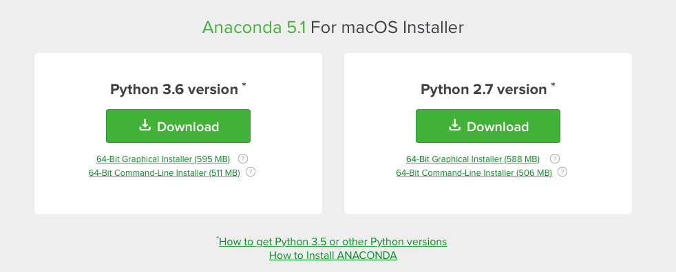

# pythondrops
## Python drops &amp; technology

(c) 2018 [**Cleuton Sampaio**](https://github.com/cleuton).

# PythonDrops 2: python 2 e python 3

É, caro amigo... Python 2 e Python 3 são incompatíveis. Python 3.x é a versão corrente, e python 2.x é legado. Você não quer desenvolver aplicações em uma plataforma "legada", não? 

Porém, atualizar seu sistema para python 3.x pode lhe criar vários problemas. Muitos instaladores e scripts de produtos, especialmente no Linux, podem apresentar problemas se você atualizar o python do S.O. O que fazer? 

Uma opção é utilizar um "ambiente virtual" para isto, como o "VirtualEnv": 

https://virtualenv.pypa.io/en/stable/

Ele permite criar um ambiente "virtual" (não é uma máquina virtual) na qual você pode instalar qualquer versão do Python e de suas bibliotecas. 

Eu prefiro utilizar outra solução: O [**Anaconda**](https://www.anaconda.com).

O **Anaconda** é um gerenciador de instalações virtuais, que pode ser utilizado com Python e R,e inclui mais de 250 pacotes para instalação. Ele funciona em Windows, Linux e MacOS. 

**Instalando o Anaconda**

Entre no link https://www.anaconda.com/download/ e selecione o seu sistema operacional. Escolha a versão de Python que deseja instalar: 



Baixe e execute o instalador.

**Criando um ambiente virtual**

A maneira mais fácil é criar um arquivo YAML definindo seu ambiente. Por exemplo, na pasta deste artigo tem um [arquivo YAML de exemplo](./ds-env.yml). 
```
name: datascience
dependencies:
  - numpy
  - scipy
  - pandas
  - scikit-learn
  - scipy
  - jupyter
  - matplotlib
  - statsmodels
  - python=3.6
  - pip:
    - tensorflow
    - tensorflow-tensorboard
```
Ele cria um ambiente chamado "datascience" contendo todas as bibliotecas listadas como "dependencies", e também instala outras, utilizando o "pip".

Para criar este ambiente basta usar o comando: 
```
conda env create -f ds-env.yml
```
Para entrar no seu ambiente virtual, digite o comando: 

**Windows:**
```
activate datascience
```
**Linux/MacOS:**
```
source activate datascience
```
Você pode instalar qualquer coisa no seu ambiente virtual. No meu caso, eu instalei o Jupyter (IPython).
